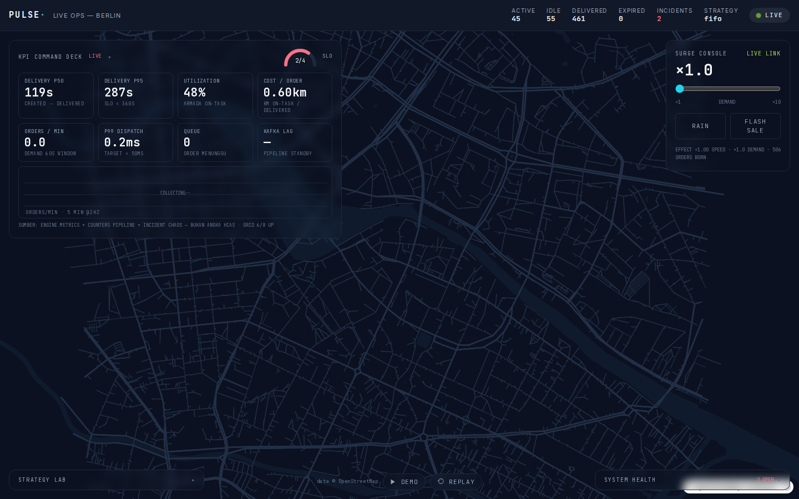
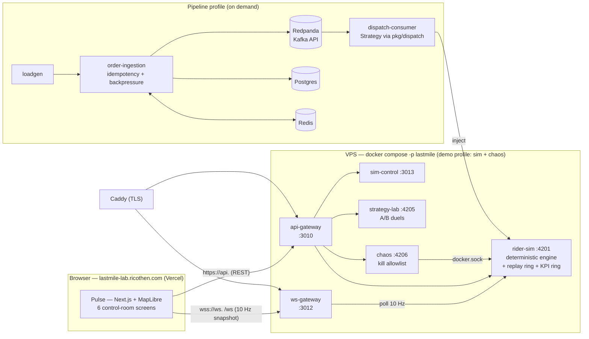

# lastmile-lab

**Mission control for last-mile delivery** — an open simulation & benchmark platform for
delivery operations: explainable rider dispatch (4 strategies, p99 decision < 15 ms), an
order pipeline that survives a 10× flash-sale surge with zero message loss, chaos-tested
self-healing, and a live control-room dashboard where **every claim is a reproducible number**.

[](https://github.com/ricothenfx/lastmile-lab/actions/workflows/ci.yaml)
[](https://github.com/ricothenfx/lastmile-lab/actions/workflows/images.yaml)

**Live:** [lastmile-lab.ricothen.com](https://lastmile-lab.ricothen.com) (UI, Vercel) ·
[api.lastmile-lab.ricothen.com/healthz](https://api.lastmile-lab.ricothen.com/healthz) ·
[ws.lastmile-lab.ricothen.com/healthz](https://ws.lastmile-lab.ricothen.com/healthz)



## Try it (90 seconds)

The public demo runs the deterministic simulation (100 riders, Berlin road network from
OpenStreetMap) 24/7 — and it **never goes white**: if the backend is unreachable, the
dashboard switches to recorded replay mode by itself.

| Screen | What to do |
|---|---|
| **Live Ops Map** | Watch 100 riders on a dark Berlin map — assignment lines, order pulses, 60 fps interpolation |
| **▶ Golden Demo** | Dock → pick *Dinner Rush*: a narrated 90-second surge story — surge ×6, rain, a rider-sim kill that self-heals (MTTD ~0,6 s) — every step lands on the same second, every run |
| **Strategy Lab** | Run `optimal` vs `fifo` on an identical seeded scenario; twin replay maps + delta table + histogram; export JSON |
| **Surge Console** | Drag surge ×1→×10, toggle RAIN / FLASH SALE — the map reacts in < 1 s |
| **KPI + System Health** | Real numbers only: p50/p95 delivery, p99 dispatch, cost/order from a 512-sample engine ring; pipeline particles; chaos incident timeline |
| **Replay & Inspect** | Scrub the last 15 minutes (≤ 0,2 s accuracy), click a rider/order → status + **the reason dispatch chose it** |

Mutation endpoints (demo control, chaos, lab) are intentionally public on `api.` — risk
decision in [ADR D23](docs/BLUEPRINT.md); everything is allowlisted, self-healing, and
synthetic-data only.

## Measured results (every number reproducible — see [reports/](reports/))

| Area | Result | Source |
|---|---|---|
| **Dispatch decision latency** (p99, 100 orders × 100 riders, 1 CPU cap) | batching **2,56 ms** · fifo 3,05 · zone 5,51 · optimal 13,14 ms — target < 50 ms | [phase-03-bench](reports/phase-03-bench.md) |
| **Optimal vs FIFO**, rush 600 s virtual, identical seed | delivered **255 vs 129 (+98%)**, expired 27 vs 46, cost/order **0,93 vs 2,04 km (−54%)** | [phase-03-bench](reports/phase-03-bench.md) |
| **Steady state** (70% capacity) | all four strategies statistically identical — strategy choice only pays under pressure | [phase-03-bench](reports/phase-03-bench.md) |
| **Pipeline under 10× spike** (300/min base, 3000/min spikes, 300 s) | **zero message loss**: sent = acked = consumed = stored = injected = 4 849, 429 = 0, duplicates = 0, lag = 0; POST p50 175 ms / p99 1 903 ms | [phase-02-loadtest](reports/phase-02-loadtest.md) |
| **Chaos self-healing** (4 kills, restart policy only) | MTTD **0,81–1,30 s**, MTTR **1,98–3,02 s**; consumer killed under 300/min + spike: **5 460 = 5 460** zero loss | [phase-04-chaos](reports/phase-04-chaos.md) |
| **Replay engine** | 15-min ring @ 5 Hz = 4 500 frames = **11,9 MiB gzip** in rider-sim (RSS 46 MiB / 160 MiB limit); scrub accuracy ≤ 0,2 s | [phase-05-replay](reports/phase-05-replay.md) |
| **Golden Demo determinism** | 7-step 90 s narrative finishes at **t+90,0 s** across runs; kill step → incident MTTD 642 ms, auto-recovery | [phase-05-replay](reports/phase-05-replay.md) |
| **Frontend frame budget** | canvas draw EMA **3,1 ms/frame**, p50 frame 16,7 ms (= 60 fps vsync), React renders throttled to 2 Hz | PROGRESS fase 1 |
| **Production stack** (demo mode) | 6 containers, ~95 MiB actual / **1 888 MiB total limit ≤ 2 GB**, healthz 200 via HTTPS < 0,15 s | [phase-06-prod](reports/phase-06-prod.md) |

## Architecture



- **Deterministic core, zero LLM.** Rider→order assignment is combinatorial optimization
  (FIFO / Batching / Zone / Hungarian-optimal, pure Go) behind one `Strategy.Assign`
  interface — every decision carries a human-readable *reason*. An optional AI Ops
  Copilot (Phase 7) may only *propose* plans; **the simulator is the judge** and a human
  decides. Deterministic = same seed, same run — that's what makes replay, duels, and the
  Golden Demo honest.
- **The demo never dies.** Frontend works 100% offline: recorded fixture (phase 1) or the
  15-minute replay ring (phase 5). Backend down ≠ site down.
- **Budget-driven infra.** Everything containerized with explicit `mem_limit`/`cpus`,
  healthchecks, log rotation, total stack ≤ 2 GB on a shared 4-core/8-GB VPS. Build in
  GitHub Actions → GHCR → VPS only pulls.

Key decisions as short ADRs: [docs/BLUEPRINT.md](docs/BLUEPRINT.md) (D1–D23) — Go,
Redpanda-not-Kafka, self-hosted MapLibre tiles from OSM (no API keys), virtual-clock
deterministic engine, single-member gzip replay dumps, public-mutation risk decision.

## Reproduce it

```bash
# 1) Demo stack (safe 24/7, no infra needed — generator is internal)
docker compose -p lastmile --profile sim --profile chaos up -d
curl localhost:3010/healthz

# 2) UI locally (points at the stack)
cd apps/web
NEXT_PUBLIC_WS_URL=ws://localhost:3012/ws NEXT_PUBLIC_API_URL=http://localhost:3010 \
  npm ci && npm run dev

# 3) Full pipeline + 5-minute load test (10× spikes, zero-loss proof)
docker compose -p lastmile -f deploy/compose.yaml -f deploy/compose.pipeline.yaml \
  --profile infra --profile sim --profile pipeline --profile loadtest up -d
docker logs -f lastmile-loadgen          # LOADGEN_FINAL: sent == acked == consumed
curl localhost:3010/api/metrics          # counters per layer
# afterwards back to demo: docker compose -p lastmile --profile sim --profile chaos up -d

# 4) Strategy duel (A/B) + export
curl -s localhost:3010/api/lab/run -d '{"strategy_a":"fifo","strategy_b":"optimal","preset":"rush","seconds":600}'
curl -s localhost:3010/api/lab/results | jq

# 5) Chaos: kill a service under traffic, watch self-heal + incident timeline
curl -s localhost:3010/api/chaos/kill -X POST -d '{"target":"rider-sim"}'
curl -s localhost:3010/api/chaos/incidents | jq   # MTTD / MTTR per incident

# 6) Replay dump (last 15 minutes, single-member gzip)
curl -s localhost:3010/api/replay/sessions | jq
```

Dispatch micro-benchmarks (p99 table above): `reports/phase-03-bench.md` §6 — commands
and hardware conditions included. Deploy automation & VPS runbook:
[deploy/README.md](deploy/README.md) (`scripts/deploy.sh` or push → GHCR → auto-deploy).

## Repository map

| Path | What |
|---|---|
| `AGENTS.md` | Working contract for AI/dev sessions — read first |
| `docs/BLUEPRINT.md` | Vision, research evidence, architecture, ADRs D1–D23 |
| `docs/ROADMAP.md` | Phases 0–7 with Definition of Done |
| `docs/DESIGN.md` | Design system: tokens, motion rules, UI checklist |
| `docs/PROGRESS.md` | Current work status log |
| `docs/blog/` | Technical articles |
| `apps/web/` | Pulse control room (Next.js 14 + TS + Tailwind + Framer Motion) |
| `apps/services/` | Go services + `pkg/dispatch` + `internal/sim` |
| `deploy/` | Compose profiles, Caddy site blocks, VPS runbook |
| `reports/` | Phase reports with raw measured numbers + UI verification evidence |
| `scripts/` | `deploy.sh` — one-command deploy (same path as CI) |

## Development principles

1. **Deterministic, explainable, measured.** Real algorithms for real-time decisions; a
   number without a source metric is a bug, not a decoration.
2. **The demo must never die.** Replay mode keeps the site alive even if the backend is down.
3. **Design is a hard requirement.** Motion has meaning, dark tokens everywhere, 60 fps
   verified; `prefers-reduced-motion` respected everywhere.
4. **Infrastructure as documented fact.** Resource limits, health checks, explicit compose
   project names, port registry — see `deploy/README.md`.

## License & disclaimer

© 2026 lastmile-lab contributors. Educational/simulation project — **not affiliated with
any delivery company**. Map data © [OpenStreetMap](https://www.openstreetmap.org/copyright)
contributors.
