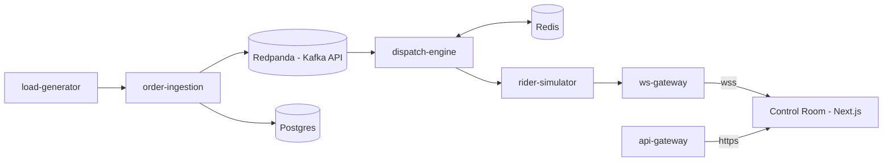

# lastmile-lab

**Mission control for last-mile delivery** — an open simulation & benchmark platform for
delivery operations: intelligent rider dispatch, an order pipeline that survives 10×
surges, and a live control-room dashboard where every claim is a reproducible number.

> Status: **Phase 0 of 7 — booting.** Roadmap: [`docs/ROADMAP.md`](docs/ROADMAP.md) ·
> Live demo (Fase 1+): https://lastmile-lab.ricothen.com

## Why this exists

Last-mile delivery is the cost core of every delivery/quick-commerce company: rider pay,
delivery-time promises, and order surges at dinner rush decide profitability. lastmile-lab
simulates that problem on a **real city map (OpenStreetMap)** and measures what actually
matters:

| Question | Measured by |
|---|---|
| Which dispatch strategy is best? | avg/p95 delivery time, rider utilization, cost per order — same scenario, side-by-side |
| Can the pipeline survive a flash sale? | load tests ×10 spike: throughput, p99 latency, zero message loss |
| Can it heal when a node dies? | chaos experiments: MTTD/MTTR, error budget |
| Is it fast enough for real decisions? | p99 dispatch decision < 50 ms |

Every number is reproducible (`make benchmark` → report in `reports/`). No invented
metrics — benchmark before/after, simulation on public data, chaos experiments, model
evaluation, and open-source contributions are the only accepted sources.

## Architecture (target)

- **Deterministic core, zero LLM.** Rider→order assignment is combinatorial optimization
  (FIFO / Batching / Zone / Hungarian-optimal) — milliseconds, explainable. An optional
  AI Ops Copilot (Phase 7) only *proposes* plans; the **simulator is the judge** and a
  human decides.
- **Go services**, Kafka-compatible bus (Redpanda), Redis, Postgres, Kubernetes-ready.
- **Frontend:** Next.js + TypeScript + MapLibre GL/deck.gl (open map, no API keys) with a
  design system built for 60 fps motion. Six control-room screens: Live Ops Map, Surge &
  Chaos Console, KPI Command Deck, Strategy Lab, System Health, Replay & Inspect.

## Repository map

| Path | What |
|---|---|
| `AGENTS.md` | Working contract for AI/dev sessions — read first |
| `docs/BLUEPRINT.md` | Vision, research evidence, architecture, ADRs |
| `docs/ROADMAP.md` | Phases 0–7 with Definition of Done |
| `docs/DESIGN.md` | Design system: tokens, motion rules, UI checklist |
| `docs/PROGRESS.md` | Current work status log |
| `apps/web/` | Frontend (static landing now, Next.js app from Phase 1) |
| `apps/services/` | Go backend services (Phase 1+) |
| `deploy/` | Docker Compose, Caddy site blocks, VPS runbook |

## Development principles

1. **Deterministic, explainable, measured.** Real algorithms for real-time decisions;
   LLM only where language reasoning adds value (and always human-in-the-loop).
2. **The demo must never die.** Replay mode keeps the site alive even if the backend is down.
3. **Design is a hard requirement.** Motion has meaning, dark tokens everywhere, 60 fps
   verified on mid-range hardware.
4. **Infrastructure as documented fact.** Resource limits, health checks, explicit compose
   project names, port registry — see `deploy/README.md`.

## License & disclaimer

© 2026 lastmile-lab contributors. Educational/simulation project — **not affiliated with
any delivery company**; no proprietary assets or data from third parties are used.
