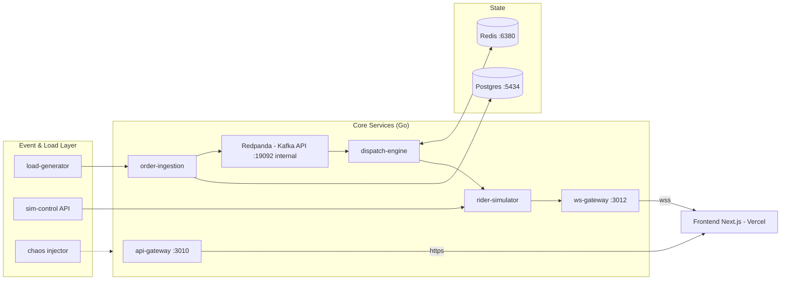

# BLUEPRINT — lastmile-lab

> Sumber kebenaran visi & arsitektur. Setiap keputusan arsitektur baru wajib dicatat di
> sini sebagai ADR (Architecture Decision Record) ringkas dengan tanggal.

---

## 1. Ringkasan Eksekutif

lastmile-lab adalah platform simulasi operasi last-mile delivery yang:

1. **Menyerang masalah inti bisnis perusahaan delivery** (biaya rider, janji waktu tempuh,
   ketahanan saat order surge) dengan simulasi kota nyata (OpenStreetMap).
2. **Terukur**: setiap klaim disertai angka dari benchmark yang bisa direproduksi
   (p99 latency, throughput, delivery time, utilization, cost per order).
3. **Tampil kelas produksi**: control-room dashboard gelap dengan peta hidup 60fps —
   bukan demo tutorial.
4. **Tahan banting**: replay mode membuat situs tetap hidup bahkan saat backend mati.

Dikembangkan bertahap (fase 0–7), setiap fase berakhir dengan demo yang jalan + indah,
commit dan push. Source of truth = repo ini, bukan percakapan chat.

## 2. Dasar Riset (mengapa dibangun seperti ini)

Riset terhadap Delivery Hero (careers portal, JD aktual, GitHub org) — Sep 2026:

| Temuan | Bukti | Implikasi ke project |
|---|---|---|
| Tech stack backend: Java/Kotlin/Go, microservices HA | JD "Sr Software Engineer Backend" | Services ditulis dalam **Go**; pola microservices + idempotency |
| Redis, MySQL/Mongo, AWS, observability eksplisit | JD yang sama | Stack memakai Redis + Postgres + metrics pipeline (Prometheus-compatible) |
| K8s/Helm/Argo/Atlantis/Grafana-Loki-Cortex | GitHub org `deliveryhero` (helm-charts 566★, dsb.) | Deploy skeleton docker compose dulu, manifest K8s sebagai artefak bonus portofolio |
| Infra AI agents aktif (`asya` — actor mesh utk AI agents, Python) | Repo aktif Sep 2026 | Fase 7 AI Ops Copilot — sebagai plugin, bukan core |
| Leadership Principles: Dive Deep ("Challenge the Data"), Deliver Value Fast, Own It | careers portal | Setiap fitur harus punya angka; demo interaktif; no fake metrics |
| Domain bisnis: order → vendor → rider → customer, quick commerce 15-min | 749 lowongan, 50 Logistics, 29 Data | Simulasi dispatch + surge + replay = jantung project |

**Kredibilitas angka** hanya dari 5 sumber: (1) load-test sebelum/sesudah, (2) simulasi
dengan data publik (OSM), (3) eksperimen chaos/SRE terukur, (4) evaluasi model vs baseline,
(5) kontribusi OSS. Tidak ada angka karangan.

## 3. Prinsip Sistem

1. **Core deterministik, tanpa LLM.** Keputusan operasional realtime (assign rider→order)
   adalah optimisasi kombinatorial: butuh < 50 ms, deterministik, explainable. LLM di
   posisi itu = salah alat.
2. **AI sebagai lapisan planning/penjelasan** (Fase 7, plugin): LLM *mengusulkan* Plan A/B/C
   → **simulator menjadi hakim** (dry-run tiap plan, keluar angka prediksi) → manusia
   memutuskan → eksekusi live. Human-in-the-loop. Tanpa API key, fitur tersembunyi,
   aplikasi tetap utuh (pola adapter).
3. **Semua interaktif, bukan video pasif.** Reviewer bisa menarik slider surge, menyalakan
   hujan, membunuh node — sistem bereaksi realtime.
4. **Angka selalu bisa ditelusuri** ke metrik internal yang terekspos via API.

## 4. Arsitektur Target

Komponen & tanggung jawab:

| Komponen | Bahasa | Tanggung jawab |
|---|---|---|
| `order-ingestion` | Go | API penerima order, idempotency (Redis), backpressure, publish ke Kafka |
| `dispatch-engine` | Go | 4 strategi assign: FIFO, Batching, Zone-based, Optimal (Hungarian/OR-Tools) |
| `rider-simulator` | Go | Rider bergerak di road network OSM (OSRM/Valhalla graph), event cuaca/macet |
| `ws-gateway` | Go | Streaming posisi rider/order/KPI ke frontend via WebSocket |
| `api-gateway` | Go | REST untuk KPI, hasil benchmark, replay metadata, health |
| `sim-control` | Go | API kontrol simulasi: preset Golden Demo, slider surge, chaos (Fase 4+) |
| `load-generator` | Go | Trafik sintetis (Poisson rush-hour), skenario spike ×10 |
| `apps/web` | TS/Next.js | Control room: Live Map, Surge Console, KPI Deck, Strategy Lab, System Health, Replay |

Dispatch tetap di-balik interface `Strategy` — strategi baru bisa ditambah tanpa menyentuh
pipeline. Hasil assignment disertai alasan (explainability) untuk panel Replay.

## 5. Keputusan Arsitektur (ADR ringkas)

| # | Tanggal | Keputusan | Alasan |
|---|---|---|---|
| D1 | 2026-09-30 | Backend **Go** (bukan Kotlin/Java) | Match JD target; ringan di RAM (VPS 8 GB penuh); single binary di image kecil |
| D2 | 2026-09-30 | **Redpanda** bukan Kafka (API kompatibel) | RAM ~½–¼ Kafka JVM; VPS hanya sisa ~1–2 GB. Cerita "Kafka" tetap valid |
| D3 | 2026-09-30 | Peta **MapLibre GL + deck.gl** | Open source, tanpa API key/billing — demo tidak bisa mati karena kuota |
| D4 | 2026-09-30 | Frontend **Next.js + TypeScript + Tailwind + Framer Motion** | Ekosistem matang; Vercel native; motion primitives untuk 60fps |
| D5 | 2026-09-30 | **Postgres & Redis instance sendiri** (5434/6380) | Jangan meminjam 5433/6379 milik aviation — coupling = risiko 24h uptime |
| D6 | 2026-09-30 | Frontend **Vercel**; backend **VPS + Caddy** (`api.` & `ws.` subdomain) | Vercel = tidak tidur + preview per fase; backend heavy stack tidak muat di free tier pihak ketiga; Caddy milik turnaround-prod cuma ditambah site block + reload |
| D7 | 2026-09-30 | Build di **GitHub Actions → GHCR → VPS pull** | Load VPS sudah 2x oversubscribed; build di VPS bisa mengganggu produksi lain |
| D8 | 2026-09-30 | LLM **bukan bagian core**; Fase 7 plugin | Lihat Prinsip #1–2; demo Golden Demo harus selalu jalan offline |
| D9 | 2026-09-30 | **Replay mode** wajib sejak Fase 5 | Anti-halaman-mati saat reviewer datang di waktu apa pun |
| D10 | 2026-09-30 | Penamaan netral `lastmile-lab` | Portabel ke semua perusahaan sejenis (DH, Wolt, Deliveroo, Bolt, Uber Eats, Getir) |
| D11 | 2026-09-30 | Isolasi VPS: blok port sendiri, limit CPU/RAM per container, log rotation | Lihat `deploy/README.md`; registry di `/home/rico/PORTS.md` |
| D12 | 2026-09-30 | Peta **tanpa tile provider eksternal** — style MapLibre self-hosted dari ekstrak OSM (roads/water GeoJSON di repo, generator `tools/graphgen`) | Nol API key/kuota/billing (memperkuat D3); visual 100% konsisten token; ekstrak inner-city Berlin 9.459 node / 18.571 edge cukup untuk demo & sim |
| D13 | 2026-09-30 | Engine simulasi **virtual-clock deterministik** (`Tick(dt)`, seed RNG) di `internal/sim`; ws-gateway & api-gateway konsumsi snapshot via HTTP internal 10 Hz (polling), bukan langsung import | Sim, fixturegen, dan test = kode yang sama; kontrak `model.Snapshot` stabil sehingga Fase 2 bisa ganti sumber order ke Redpanda tanpa sentuh frontend; polling 10 Hz cukup (client di-interpolasi 60 fps) |
| D14 | 2026-09-30 | Replay fallback sejak Fase 1 = **fixture rekaman nyata** dari simulasi (`tools/fixturegen`, seed tetap, 5 Hz) yang di-commit; frontend memutar loop + banner saat WS mati | Anti-halaman-mati sejak hari pertama (D9 dipercepat dari Fase 5); data replay bukan karangan — direkam dari engine yang sama |
| D15 | 2026-09-30 | **Topologi pipeline Fase 2**: ingestion (Redis idem + Postgres + ack Kafka sync) → topic `orders` 3 partisi → dispatch-consumer menjalankan `Strategy` bersama (`pkg/dispatch`, dipindah dari internal/sim tanpa refactor frontend) → **injeksi assignment ke rider-sim via HTTP internal** (`POST /internal/orders`), bukan consumer Kafka kedua di rider-sim; engine memvalidasi ulang & fallback FIFO internal; dedupe tiga lapis (consumer LRU, engine seen-set, unique index DB) | rider-sim tetap ringan & bisa jalan tanpa broker (`ORDER_SOURCE=internal` default → demo tidak pernah mati); at-least-once aman; Fase 3 cukup menambah Strategy di satu tempat |
| D16 | 2026-09-30 | Observability Fase 2 = **metrik JSON** (`/metrics` per service + agregat `/api/metrics` di api-gateway) + laporan load test di `reports/`; Grafana ditunda ke Fase 4. **DITINJAU ULANG di Fase 4 (2026-09-30): tetap metrik JSON, Prometheus/Grafana TIDAK dipasang** | Opsi spec fase 2 saat RAM sempit (host load 8+, Grafana +Prometheus ≈ 300–400 MB di atas stack); angka zero-loss tetap terukur & terdokumentasi. Review Fase 4: limit stack sudah 1.856 MiB (chaos +64 MiB); menambah Prometheus (:9091, realistis ≥128 MiB) + Grafana (:3030, ≥192 MiB) mendorong total ≥ 2.176 MiB → **melanggar anggaran keras ≤ 2 GB**. KPI Command Deck + System Health di UI memenuhi kebutuhan observability fase ini (angka dari metrik nyata), jadi Grafana/Prometheus tidak memberi nilai tambah yang sepadan dengan risiko RAM VPS 8 GB yang dipakai stack lain |
| D17 | 2026-09-30 | Strategi `optimal` = **Hungarian/Jonker-Volgenant murni Go** O(n²m) di `pkg/dispatch` — BUKAN OR-Tools | OR-Tools = binding C++/CGO: image membengkak, build berat, dependency risiko; JV cukup untuk n ≤ 500 (p99 terukur 13,1 ms @ 100×100, `reports/phase-03-bench.md`); deterministik & bebas dependensi (prinsip "core deterministik tanpa LLM" tetap murni Go) |
| D18 | 2026-09-30 | **Strategy Lab** = service `strategy-lab` :4205 (internal saja) menjalankan duel: SATU generator order (seed sama) di-pipe ke DUA engine identik per tick — bukan dua generator; metrik level engine (delivery dur, km on-task, rider-ms busy) ditambah di `internal/sim` tanpa mengubah kontrak `model.Snapshot`; hasil via REST `/api/lab/*` (proxy api-gateway), frame replay pakai bentuk `model.Snapshot` yang sama | Keadilan A/B = input byte-identical; kontrak snapshot tidak breaking (frontend fase 1–2 aman); reuse wire format = renderer peta kembar murah; satu duel bersamaan + RAM 256 MiB = ramah VPS 4-core |
| D19 | 2026-09-30 (rev. 2) | **Chaos injector** = service `chaos` :4206 (internal saja, profile compose `chaos`) berbicara ke Docker Engine API via unix socket: kill = **SIGKILL ke PID 1 di dalam container via Docker exec API** (perintah exec FIXED `kill -9 1`, bukan exec arbitrer) dari **allowlist eksplisit 7 service stateless `lastmile-*`** (rider-sim, ws-gateway, api-gateway, sim-control, order-ingestion, dispatch-consumer, strategy-lab) — postgres/redis/redpanda/chaos sendiri dan semua container di luar project DITOLAK (403); pemulihan TIDAK pernah manual — yang diukur justru restart policy `unless-stopped` Docker (self-heal); monitor healthz 1 Hz + flap suppression 2 kegagalan beruntun membuka/menutup incident {t_start, t_detect, t_recover}; incident persist ke volume `chaos_data`. **Rev. 2 (2026-10-01): endpoint `/containers/{id}/kill` Docker 29 TIDAK memicu restart policy** (container dianggap dihentikan manual — terverifikasi di VPS: exit 137 tanpa restart), sedangkan crash PID 1 dari dalam container memicunya (terverifikasi) — jadi kill di-inject via exec; ini juga lebih otentik sebagai kegagalan proses | Spec fase 4 mensyaratkan allowlist eksplisit tanpa wildcard + DILARANG menyentuh stack lain; docker.sock = hak istimewa besar → dibatasi: satu-satunya service lastmile dengan mount itu, berjalan root (akses socket), tanpa publish port, allowlist tervalidasi kode + unit test (deny postgres/stack lain/wildcard), perintah exec fixed |
| D20 | 2026-09-30 | **KPI live** = instrumentasi ring fixed-cap (512 sampel) di `internal/sim`: durasi delivery created→delivered + wall-clock di sekitar `Strategy.Assign` (p50/p95 delivery, p99 dispatch), diekspos `Engine.KPI()` → rider-sim `/internal/metrics` → api-gateway `/api/kpi` (agregasi + SLO eksplisit + grid healthz cache 2 s + error budget dari chaos). Kontrak `model.Snapshot` & `Engine.Metrics()` tidak berubah | Spec fase 4: KPI dari metrik nyata tanpa fitur baru di core — ring adalah instrumentasi (tidak masuk RNG/logika; determinisme same-seed tetap diuji), bukan fitur; ring fixed-cap = memori O(1) dan semantik "performa terkini" (bukan rata-rata sepanjang umur); polling 2 Hz di-cache 400 ms agar upstream tidak dihajar; angka yang tidak terukur = null → UI "—" |

## 6. Frontend — 6 Layar Control Room ("Pulse")

1. **Live Ops Map** — peta kota gelap (Berlin dulu), rider = titik bergerak berwarna status
   (idle hijau / ke-resto kuning / pickup biru / antar ungu) + trailing glow; order = pulsa
   radar + garis dashed ke rider; zona = polygon; surge = zona membara (heatmap bernapas).
2. **Surge & Chaos Console** — slider surge ×1→×10, toggle hujan/flash-sale/fleet −30%,
   tombol kill-node; semua aksi tercatat di Incident Timeline (flight recorder).
3. **KPI Command Deck** — kartu metrik angka live (tabular mono): delivery time,
   utilization, cost/order, orders/min, p99, antrian; streaming area chart; SLO gauge;
   kartu bergetar halus saat SLO dilanggar.
4. **Strategy Lab** — jalankan strategi A vs B pada skenario identik → peta replay kembar
   + tabel delta + histogram overlay; export benchmark report (sumber angka README).
5. **System Health** — pipeline order→Kafka→processor divisualisasikan partikel; grid
   status pod; autoscaling events; p99 & RPS live (bukti load-test hidup).
6. **Replay & Inspect** — timeline ala video editor; scrub ke detik mana pun; klik rider →
   detail order yang dibawa + alasan keputusan dispatch.

Design system lengkap: `docs/DESIGN.md` (sumber token — komponen dilarang hardcode warna).

## 7. Skenario Demo

| Mode | Isi | Kapan |
|---|---|---|
| 🟢 Golden Demo Presets | 2–3 narasi kurasi (contoh "Dinner Rush di Berlin": tenang → flash sale ×8 → hujan → kill node → recovery), tombol ▶ Play | Kesan pertama reviewer — selalu konsisten |
| 🟡 Free Playground | Semua kontrol bebas dipakai reviewer, reaksi realtime | Kedalaman teknis |
| 🔵 Replay | Pemutar rekaman simulasi | Fallback saat backend tidak hidup |

## 8. Metrik Benchmark yang Dilaporkan (target format)

- Throughput order: baseline → sesudah optimasi (req/menit, zero loss)
- p99 latency API keputusan dispatch (< 50 ms target)
- Delta antar strategi dispatch: avg/p95 delivery time, rider utilization, cost per order
- Chaos: MTTD/MTTR, error budget, waktu self-heal
- Semua dapat direproduksi: `make benchmark` → laporan di `reports/`

## 9. Hosting & Isolasi (ringkas — detail runbook di `deploy/README.md`)

- Frontend: Vercel (Hobby) — `lastmile-lab.ricothen.com`
- Backend: VPS vmi3585780 — `api.lastmile-lab.ricothen.com` (:3010) &
  `ws.lastmile-lab.ricothen.com` (:3012) via Caddy (site block + reload, tanpa restart)
- Blok port khusus terdaftar di `/home/rico/PORTS.md` (3010/3012/3013/3030, 4201–4204,
  5434, 6380, 9091, 19092) — total budget memori stack ≤ 2 GB
- Monitor eksternal (UptimeRobot) pada `/healthz` — Fase 6
- Anti-halaman-mati: replay fallback + aset statis di Vercel

## 10. Batasan & Non-Goals

- Bukan sistem produksi sungguhan; tidak memproses data pribadi/pembayaran nyata.
- Tidak meniru brand apa pun (netral, open source style, tanpa aset Delivery Hero).
- Multi-kota (selain Berlin) = non-goal sampai Fase 6 selesai.
- Mobile app = non-goal (responsive web cukup).
